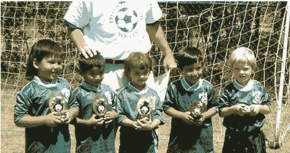

# MySpace 收到黄色警报

> 原文：<https://web.archive.org/web/http://techcrunch.com/2007/01/23/myspace-getting-amber-alerts/>

下次你决定为了啤酒钱绑架邻居的孩子时，你可能要重新考虑一下你在做什么:MySpace 现在可以发出失踪儿童的黄色警报了。随着积极分子团体和担忧的父母施加越来越大的压力，MySpace 与国家失踪和被剥削儿童中心合作，这样每当发生严重的儿童绑架案件时，就会在网站上出现安珀警报公告。

让我们面对现实吧，在享受了大约 20 次*捕捉捕食者*之后，显然有必要这样做。向你致敬，MySpace，为你朝着更好的方向前进。

[MySpace 向美国用户发送失踪儿童警报](https://web.archive.org/web/20150322155522/http://today.reuters.com/news/articlenews.aspx?type=technologyNews&storyid=2007-01-23T060848Z_01_N22494415_RTRUKOC_0_US-MYSPACE-SAFETY.xml)【路透社】