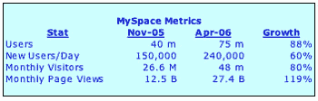

# MySpace，274 亿英镑的大猩猩 TechCrunch

> 原文：<https://web.archive.org/web/http://www.techcrunch.com:80/2006/06/13/myspace-the-27-billion-pound-gorilla/>

# MySpace，274 亿英镑的大猩猩

  值得注意的是在过去的几个月里 [MySpace](https://web.archive.org/web/20221129042544/http://www.myspace.com/) 的用户和流量大幅增加。Paul Kedrosky 从去年年底的一篇商业周刊文章中总结了 2005 年 10 月 MySpace 的关键指标。这些数据，以及最近的四月康姆斯克和 Myspace 的内部数据，总结如下。

MySpace 拥有 7500 万用户(见这里的比较数据)，1500 万每日独立登录，每天新增 24 万用户，每月产生近 300 亿页面浏览量(即每秒 10593 次页面浏览量*)。每个独立访问者产生的页面浏览量是惊人的——显然这些用户对网站非常非常有热情，不清楚他们除了在 MySpace 上闲逛还在网上做什么。*

 *

就页面浏览量而言，MySpace 还没有超过雅虎(见瑞银康姆斯克分析 [PDF，此处](https://web.archive.org/web/20221129042544/http://battellemedia.com/archives/051006%20-%20April%20US%20Audience%20Data.pdf))，但是他们稳坐第二把交椅，领先于 MSN-微软、时代华纳(包括美国在线)、易贝、谷歌和脸书等巨头。

MySpace 在搜索引擎中占有第六大市场份额，尽管他们实际上并不是一个搜索引擎。*