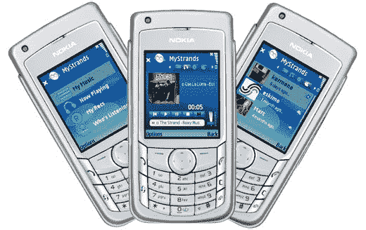

# MyStrands Mobile 为流媒体音频添加社区——TechCrunch

> 原文：<https://web.archive.org/web/http://www.techcrunch.com:80/2007/03/14/mystrands-mobile-adds-community-to-streaming-audio/>

# MyStrands Mobile 为流媒体音频添加社区

Symbian Series 60 用户应该看看 [MyStrands mobile](https://web.archive.org/web/20220517170818/http://www.mystrands.com/mystrands/mob-symbian/symbian.vm) ，这是一款引人注目的音乐共享应用程序，可以创建社交播放列表——你和你的好友可以共享音乐——并通过标签和搜索进行发现。它甚至支持多种语言，这样你和你在法国的朋友就可以分享你的塞吉·甘斯布播放列表。

这项服务访问了[600 万首歌曲的集合](https://web.archive.org/web/20220517170818/http://www.beta.techcrunch.com/2007/02/05/social-music-overview/)，所以希望有你想要的，并直接连接到你的 [MyStrands](https://web.archive.org/web/20220517170818/http://www.mystrands.com/) 页面。