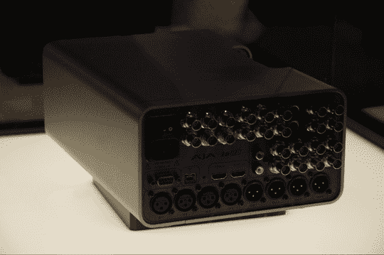

# NAB 2007:艾捷拉的火线全能| TechCrunch

> 原文：<https://web.archive.org/web/http://techcrunch.com/2007/04/17/nab-2007-ajas-firewire-do-it-all/>

# NAB 2007:艾捷拉的火线全能

艾捷拉为 Mac OS 和 Windows PCs 开发视频捕捉和播放解决方案，在 NAB，该公司为我们树立了一个榜样。Final Cut Studio 2 是苹果公司的一款外观非常棒的新数字视频编辑套件(我们将在后面详细介绍)，它包括一个名为 ProRes 422 的东西，基本上是一个用于在新的 8 路 Mactopusses 上处理和编辑未压缩 HD 的包。艾捷拉推出了一款 Firewire 视频采集盒，它是为与 ProRes 422 配合使用而全新设计的。这意味着，如果你正在寻找一个与苹果 HD tweedledum 配套的 tweedledee，这就是你的饼干。我们想亲自动手，但他们把这家伙藏在旋转基座的玻璃后面。它很酷，当然，但它不是希望钻石或任何东西。嘘。
 艾捷拉为 Mac OS 和 Windows PCs 开发视频捕获和回放解决方案，在 NAB，该公司为我们设立了一个桌面。Final Cut Studio 2 是苹果公司的一款外观非常棒的新数字视频编辑套件(我们将在后面详细介绍)，它包括一个名为 ProRes 422 的东西，基本上是一个用于在新的 8 路 Mactopusses 上处理和编辑未压缩 HD 的包。

更多信息[Aja.com]