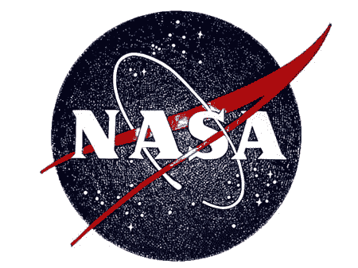

# NASA 讨厌 iPhone | TechCrunch

> 原文：<https://web.archive.org/web/http://techcrunch.com:80/2007/07/31/nasa-hates-the-iphone/>

根据 7 月 10 日的会议记录，美国宇航局将更早地将 iPhone 发射到外太空，而不是将它们发给宇航员。ODIN(NASA 的外包桌面计划)项目经理 Jeff Stephens 认为 iPhone 对 NASA 来说是不可接受的。谢谢 Jeff，我们不确定它是否已为企业做好准备，但您刚刚重申了我们之前的信念。通知群众！随着黑莓 8800 和 Treo 750s 成为美国宇航员的首选武器，RIM 和 Palm 正沐浴在荣耀之中。

[苹果 iPhone 出局，黑莓 8800 在 NASA](https://web.archive.org/web/20160404012753/http://www.informationweek.com/news/showArticle.jhtml?articleID=201202008) 【信息周刊】