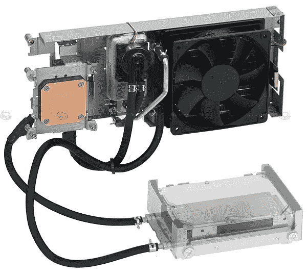

# NEC、日立发布水冷硬盘

> 原文：<https://web.archive.org/web/http://techcrunch.com/2007/07/30/nec-hitachi-announced-water-cooled-hdd/>

# NEC、日立发布水冷硬盘

在我看来，NEC 和日立的共同努力正开始实现一些有价值的产品。你在上面看到的是你的硬盘的第一个水冷系统。该系统不仅噪音低至 25dB，而且 NEC 计划为未来的台式机配备这种令人兴奋的新冷却系统。乔伊。在一个盒子里。

[NEC 和日立水冷你的硬盘](https://web.archive.org/web/20130628154548/http://www.akihabaranews.com/en/news_details.php?id=14471)【秋叶原新闻】