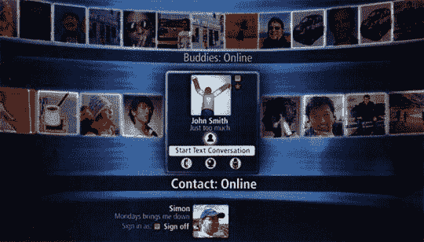

# 尼莫:就像 Windows | TechCrunch 的前排

> 原文：<https://web.archive.org/web/http://techcrunch.com/2006/10/03/nemo-like-front-row-for-windows/>

# 尼莫:就像窗户的前排

微软知道如何取得一项技术，并将其打入地下。以 Nemo 为例，它是 Windows Live 的前端，包括共享空间、Messenger 和 Live Call。该界面是为宽屏电视和显示器设计的，包括一个前排式的“懒人苏珊”系统，用于挑选要联系的人。它使用新的 Vista 表示层，让事情看起来像*少数派报告*的速度。

我听过很多关于 Vista 本质上是 OS X 的说法，这是真的，但现在是时候让 Mac 用户认为理所当然的许多花哨的用户界面最终出现在世界上最流行的操作系统中了。视觉糖果销售个人电脑，Vista 将是其中最甜蜜的。

[代号尼莫:Windows Live 遇上媒体中心](https://web.archive.org/web/20130627213026/http://liveside.net/blogs/main/archive/2006/10/02/Codename-Nemo_3A00_-Windows-Live-meets-Media-Center.aspx)