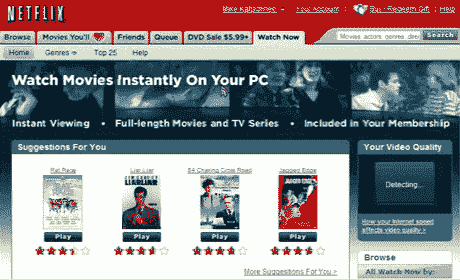
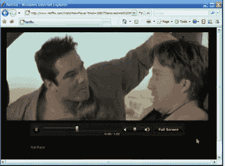
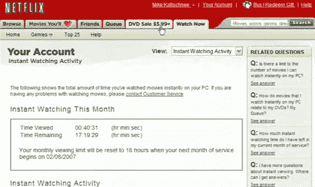

# 网飞，关于和你分手，我只是在开玩笑

> 原文：<https://web.archive.org/web/http://www.techcrunch.com:80/2007/01/16/netflix-i-was-just-kidding-about-breaking-up-with-you/>

  上个月，我写了一篇名为《[为什么我要和网飞](https://web.archive.org/web/20221219095705/http://www.beta.techcrunch.com/2006/12/20/why-i-am-breaking-up-with-netflix/)分手》的帖子，概述了我作为网飞多年忠实客户转投百视达全面访问的原因。BlockBuster 的新服务，基本上是将每部邮寄的电影转换成任何 BlockBuster 商店的免费电影优惠券，取得了巨大的成功。BlockBuster 现在有 220 万会员，在过去的两个半月里增加了 70 万。在两家公司的军备竞赛中，百视达推出了网飞没有答案的东西——网站和百视达数千家零售店之间的智能整合。

但是现在，网飞用一种真正优秀的新服务回击了 T5，这种服务可能会让势头朝着他们的方向逆转。今天早上，网飞的 600 万用户中的一部分将可以使用一种新的“立即观看”产品，这种产品可以将电视节目和电影流式传输到 Windows PC 上。其余成员将在接下来的六个月内获得访问权限。最初将有大约 1000 部电影和电视节目可供观看(包括一些热门节目，例如 NBC 的《办公室》(The Office)。为网飞新服务做出贡献的电影公司包括 NBC 环球、索尼影业、米高梅、20 世纪福克斯、派拉蒙影业、华纳兄弟、狮门影业和新线电影公司。

最棒的是，它是免费的。

网飞正在预算 4000 万美元来支付下一年的许可和管理费用，顺便说一下，这将抹去他们每个财政季度大约 1700 万美元的大部分营业利润。当然，除非这项服务带来了数百万的新用户。

电视节目和电影将流式传输到可下载的应用程序，观看时间将根据客户的网飞订阅计划而有所限制。最受欢迎的 18 美元/月计划的订户每月可以观看 18 个小时。

对于最近宣布的 IPTV 公司的绝对雪崩来说，这将是一场意义重大的竞争。预计 [YouTube](https://web.archive.org/web/20221219095705/http://www.beta.techcrunch.com/tag/youtube) 、 [Joost](https://web.archive.org/web/20221219095705/http://www.beta.techcrunch.com/2007/01/15/venice-project-launch-name-joost/) 和 iTunes、 [Zudeo](https://web.archive.org/web/20221219095705/http://www.beta.techcrunch.com/2006/12/19/first-big-partner-for-zudeo-bbc/) 、CinemaNow、MovieLink [和其他](https://web.archive.org/web/20221219095705/http://www.beta.techcrunch.com/2006/10/15/itunes-movies-v-the-rest/)都将通过非常不同的产品争夺相同的眼球。

检查[crunchbear](https://web.archive.org/web/20221219095705/http://crunchgear.com/2007/01/16/patent-monkey-more-on-netflix-internet-movie-streaming/)他们对此事的看法。另请参见 [HackingNetflix](https://web.archive.org/web/20221219095705/http://www.hackingnetflix.com/2007/01/demo_netflix_wa.html) 获取该产品的屏幕演示。屏幕截图如下。

