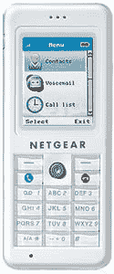

# NETGEAR 推出支持 WiFi Skype 的 SPH101 | TechCrunch

> 原文：<https://web.archive.org/web/http://techcrunch.com:80/2006/09/12/netgear-ships-wifi-skype-enabled-sph101-2/>

美国网件公司(Netgear)今天宣布，它已经开始运送其 WiFi Skype 电话 SPH101 的预订。他们也将很快发货给零售商。这也是一部非常可爱的小手机，配有 TFT 显示屏，不需要额外的软件。如果你想买一个，只需区区 249.99 美元。

[NETGEAR 为 Skype 批量提供 SPH101 WiFi 电话](https://web.archive.org/web/20150920011047/http://www.ehomeupgrade.com/entry/3014/netgear_ships_sph101)【ehome upgrade】