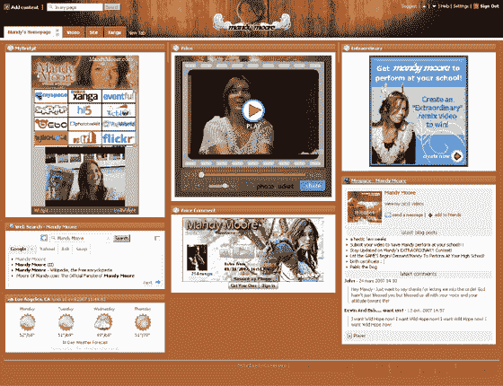
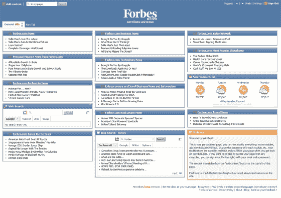

# Netvibes 发布宇宙:定制公共页面 TechCrunch

> 原文：<https://web.archive.org/web/http://www.techcrunch.com:80/2007/04/16/netvibes-launches-universe-customized-public-pages/>

# Netvibes 发布宇宙:定制公共页面

  今天下午 [Netvibes](https://web.archive.org/web/20221004195339/http://netvibes.com/) 将宣布推出 Netvibes Universe，允许用户创建高度定制的 Netvibes 版本，并发布给公众访问。Netvibes 为此次发布创建了大约 100 个品牌版本——用户将能够在大约六周内创建这些版本。

除了公开页面之外，出版商还可以通过添加自己的 CSS 和 HTML 来高度定制他们的 Universe 页面。

TechCrunch 的宇宙页面位于[Netvibes.com/TechCrunch](https://web.archive.org/web/20221004195339/http://www.netvibes.com/universe)，上面有许多我最喜欢的新闻和一些小工具。为许多艺术家(50 Cent、本·哈珀、亚声调、G-Unit、曼迪·摩尔、莫比、Pretty Ricky 和 Snoop Dogg)和主要新闻网站(CBS、CNN Money、Forbes.com、LATimes.com、新闻周刊、体育画报、时代公司、USAToday 和 washingtonpost.com)创建了额外的宇宙页面。完整的名单将于今天晚些时候在这里公布。

Netvibes 用户可以点击并添加任何公共页面，或公共页面的一部分，到他们自己的帐户并接收更新。

Pageflakes 也有[公共页面](https://web.archive.org/web/20221004195339/http://www.beta.techcrunch.com/2006/10/03/pageflakes-20-to-launch/)你可以与每个人或一组精选的朋友分享，但不支持你自己的 CSS。

