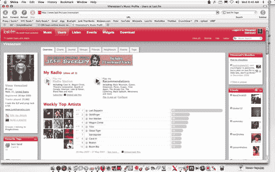

# 永远不要从这个网站购买任何东西

> 原文：<https://web.archive.org/web/http://techcrunch.com/2007/06/11/never-buy-anything-from-this-website/>

# 永远不要从这个网站买东西

大约一周前，[我发布了这张我用 M-Audio 的 Torq Mixlab 制作的 DJ 混音版](https://web.archive.org/web/20130628184218/http://crunchgear.com/2007/05/31/m-audio-torq-mixlab-revisited/)。为了得到一些热门的音乐，我实际上不得不花钱购买非常难找的白色标签 DJ 混音，我一点也不介意。我用的是 DJDownload.com，它有很棒的曲目选择，很好的用户界面，很好的价格，以及不受限制的，没有 DRM 的 MP3 文件。
 昨天，我找不到我想要的混音。我最终尝试了一个叫做 7Digital.com 的网站。在欺骗我认为我正在购买一个 192Kbps 的无 DRM 的 MP3 文件后，我支付了相当于一英镑的美元，并去下载我的歌曲。只有在付款后，7Digital 才会提到你得到的是一个塞满 DRM 的 192Kbps WMA 文件。我很生气，但我尽力了。我去回放文件，这样我至少可以把它转换成 MP3，听听它听起来像什么。你猜怎么着？它没玩，现在还不玩，永远也不会玩。

所以我给 7Digital.com 发了封电子邮件，要求他们退款，并声明我再也不会使用他们这个极具欺骗性的网站了。我得到的回复基本上是告诉我我错了，我应该更新 Windows Media Player 等等。等等。只有几行废话。猜猜看。我受够了他们。他们可以拿走从我身上赚来的一两美元，作为回报，我警告你们所有人永远不要使用 7DIGITAL.COM。如果你有一个网站、博客，甚至是小学报纸，一定要转贴出来，告诉人们他们会拿走你的钱，不会送货上门。为了安全起见，在从你不知道的新网站下载之前先了解事实。

更新:那些混蛋知道他们惹错了人，给我退款了。公开反对骗子。