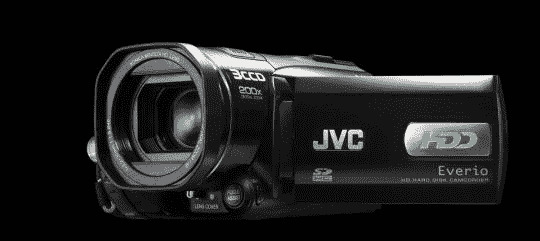

# 新的 3CCD，高清 JVC Everio 将于 9 月推出

> 原文：<https://web.archive.org/web/http://techcrunch.com/2007/07/19/new-3ccd-hi-def-jvc-everio-coming-in-september/>

基于硬盘的 JVC Everio 系列的粉丝将很高兴听到一个新的三芯片高清版本将于 9 月初上市。

GZ-HD3 将采用 1440×1080 高清录制，三个 16:9 逐行扫描 CCD，一个 60GB 硬盘，重量为一磅半。遗憾的是，录音只有 1080i，但对于日常使用来说还是足够好的。

我有一台 Everio 摄像机，非常喜欢。录制到硬盘上比购买磁带要方便得多(也便宜得多),而且能够在几分钟内将镜头直接传输到计算机上是一个巨大的优势。除此之外，电池续航时间非常长，而且体积小巧，可以随身携带。

GZ-HD3 将于 9 月初上市，售价约为 1300 美元。

[JVC 发布新的 3CCD 高清硬盘摄像机](https://web.archive.org/web/20151017071912/http://vpo3.virtualpressoffice.com/document.jsp?id=1184677371350)【JVC 新闻稿】