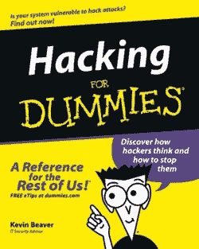

# 针对路由器和手机的新攻击百分之百成功 

> 原文：<https://web.archive.org/web/http://techcrunch.com:80/2007/04/20/new-attack-targets-routers-and-cellphones-100-percent-successful/>

# 新的攻击目标是路由器和手机，百分之百成功

关闭你的舱口、路由器和手机，因为一名安全研究人员正准备演示一种侵入并在一系列消费电子设备上运行恶意软件的方法。更糟糕的是，如果攻击是针对与网络相连的路由器，*网络上的每一台*机器都是易受攻击的。尽管据说攻击百分之百成功，而且它的代码可以被修改以改变目标路由器的固件。如果配置正确，这可能意味着您下载的每个文件都可能导致您的系统获得 0wn3d。

一个好消息是，这种攻击只对采用 Arm 或 xScale 处理器的设备有效，因此我们的 x86 boxen 稍微安全一些。

[新的攻击将路由器和手机置于危险之中](https://web.archive.org/web/20221219195146/http://news.yahoo.com/s/pcworld/20070419/tc_pcworld/130984)【PC World/Yahoo！]