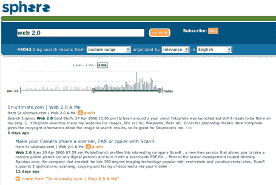
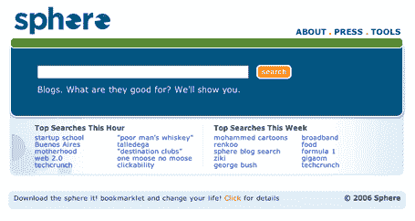

# 新博客搜索引擎 Sphere 发布 TechCrunch

> 原文：<https://web.archive.org/web/http://www.techcrunch.com:80/2006/05/01/new-blog-search-engine-sphere-launches>

  新的博客搜索引擎 [Sphere](https://web.archive.org/web/20230210060211/http://www.sphere.com/) 刚刚推出，还宣布了一轮[375 万美元的风险融资](https://web.archive.org/web/20230210060211/http://gigaom.com/2006/05/01/sphere-launches-with-new-cash/)。除了在这里报道 Sphere 的发布，我们还在 TalkCrunch 采访了首席执行官托尼·康拉德和顾问托尼·施耐德。

Sphere 紧随 Feedster、Technorati 和 IceRocket 等博客搜索引擎以及谷歌和雅虎提供的产品的脚步，正在做一些与其前辈完全不同的事情(自从我们 10 月份第一次看到它以来，它发生了巨大的变化)。

顺便说一下，Sphere 的设计是由 Adaptive Path 创建的。在这里看他们关于这个项目的文章[。](https://web.archive.org/web/20230210060211/http://www.adaptivepath.com/publications/essays/archives/000614.php)

该网站分为三个主要部分:博客搜索结果、特色博客和相关媒体。

## 博客搜索结果

Sphere [搜索结果](https://web.archive.org/web/20230210060211/http://www.sphere.com/search?q=web+2.0&sortby=rel&lang=en&datedrop=7)可以通过日期、相关性或两者的组合来查看。与 Technorati 不同，它根据博客中唯一链接的总数来确定博客的相关性，Sphere 采用的是一种算法方法。对于 Sphere 来说，“相关性”基于三个关键因素:博客内外的链接；博客周围的元数据(平均帖子长度、帖子频率等；以及帖子本身的语义分析)。在我们的测试中，Sphere 博客的相关性非常好。我们将在以后进行更深入的回顾和比较。

另一个特点是“自定义日期搜索”。除了预设的日期选择，如果您通过在下拉框中选择自定义日期搜索，您将获得该日期范围的结果，并且您还会看到每天的细分，显示每天包含的搜索结果。

每个搜索结果都有一个指向博客个人资料的链接，该博客个人资料包括基本的博客信息(进出链接、平均帖子频率和长度以及其他信息)。将来，每个博客都将有一个扩展的个人资料，其中也将包括来自博客作者的信息，如照片、地理标记的邮政编码以及博客涵盖的主题。

## 特色结果

与成千上万个搜索词最相关的博客列在“[特色搜索结果](https://web.archive.org/web/20230210060211/http://www.sphere.com/featured-blogs?q=web+2.0&sortby=rel&lang=en&datedrop=7)”区域。

如果您没有看到您正在寻找的内容的搜索结果，请单击您的搜索词中评分最高的博客进行进一步研究。这些结果基于与博客搜索相同的算法分析。

## 相关媒体

想在博客之外进行研究吗？点击[相关媒体](https://web.archive.org/web/20230210060211/http://www.sphere.com/related-media?q=web+2.0&sortby=rel&lang=en&datedrop=7)，可以看到与您的查询相关的图片、新闻、书籍和播客。

## 更多工具

尽管基本的搜索平台很棒，但我最喜欢 Sphere 的地方是在[工具](https://web.archive.org/web/20230210060211/http://www.sphere.com/tools)区域。安装“Sphere It”bookmarklet，当你阅读你想了解更多信息的内容时，点击它。Sphere 将实时分析页面，并呈现与该主题相关的博客搜索结果。重要的是要注意，这不是一个寻找链接到你正在查看的页面的博客的搜索；相反，你会发现与你正在阅读的主题相关的新鲜博客内容。我测试过这个，发现它非常有用。

祝贺 Sphere 团队启动了这个项目，并使 blog seach 又向前迈进了一两步。

