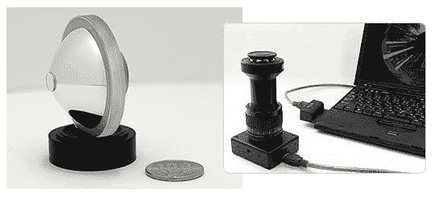

# 新相机镜头捕捉每个角落| TechCrunch

> 原文：<https://web.archive.org/web/http://techcrunch.com/2007/07/06/new-camera-lenses-capture-every-nook-and-cranny/>

一旦夏天结束，你不得不回到工作、家庭和祈祷的严酷现实中，你将如何与你远方的爱人和秘密/想象中的女朋友保持联系？当然，你可以给他们打电话，或者传真给他们一个有趣的涂鸦，但是为什么不从每个可以想象的角度让他们看看你的房间有多乱呢？

奥林巴斯刚刚推出了一款新镜头，通过使用一个复杂的棱镜和一个特殊的球形镜头将图像捕捉到 CCD 传感器，可以捕捉 360 度的照片和视频。这种透镜被吹捧为安全系统的伟大解决方案，无疑会出现在每一个以一群住在一所房子里的呼吸困难者为特色的真人秀节目中。

还在原型阶段，还没有生产或可用性的消息。

[奥林巴斯展示 360 度摄像机、投影仪](https://web.archive.org/web/20160308135857/http://www.electronista.com/articles/07/07/06/olympus.360.deg.projector/)