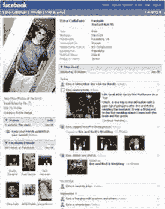
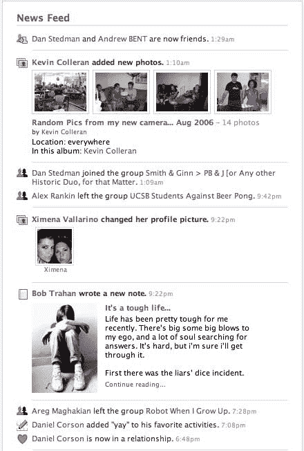

# 新脸书重新设计不仅仅是美学

> 原文：<https://web.archive.org/web/http://www.techcrunch.com:80/2006/09/05/new-facebook-redesign-more-than-just-aesthetics/>

 [【脸书】](https://web.archive.org/web/20230330121303/http://www.crunchbase.com/company/facebook)今晚发布了两项新功能和一项重大设计变更，影响到他们所有的 950 万用户。新产品名为 News Feed 和 Mini Feed，旨在改变创始人兼首席执行官马克·扎克伯格(Mark Zuckerberg)所称的脸书旧的“百科界面”，其中页面大多只是列出关于人们的信息，而是一系列关于用户、她的朋友和活动的新鲜新闻和关注内容。

周一，我去了脸书的办公室，看了刚刚发布的产品演示。这两个产品显示发生的人和事的信息。第一个是 News Feed，出现在用户的“主页”(管理)上，显示朋友发布的新照片、关系状态变化、人们加入群组等。它基本上消除了每天去每个朋友的网站查看他们的个人资料发生了什么变化的需要。从很多方面来说，这让我想起了我每天在 NetNewsWire 上查看的 RSS 新闻流，以及我关心的博客和其他网站。

第二个产品是 Mini Feed，它是 News Feed 的变体，但只为单个用户显示信息，并直接出现在他们的个人资料页面上。它让页面的访问者可以快速查看该用户的新内容。

像脸书上的所有东西一样，这两个产品都受标准的脸书隐私设置的约束。这意味着只有您允许查看此数据的人才能看到它。出现什么是基于你是谁，他们是谁，以及设置了什么规则。

这些变化会让用户困惑一段时间，但我同意 Ruchi Sanghvi 在脸书博客[上的观点，他说](https://web.archive.org/web/20230330121303/http://blog.facebook.com/blog.php?post=2207967130) *“这些功能不仅不同于我们以前在脸书上拥有的任何东西，而且也完全不同于你在网上能找到的任何东西。”*这很有趣，因为脸书很清楚注意力元流的概念，页面浏览量不是货币，而是服务让用户交流的效率。脸书用户现在将有一个更简单的方式来了解他们的朋友在做什么。这可能意味着短期内脸书的页面访问量会减少，因为用户很少需要离开他们的主页/管理页面来查看朋友们的动态，但如果这让用户更喜欢脸书(这可能吗？)，最后会有回报的。

下面的屏幕截图显示了脸书用户主页/管理页面上滚动的新闻提要。

