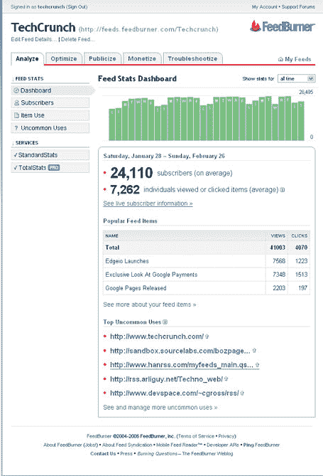

# 新的 Feedburner 统计数据和功能 TechCrunch

> 原文：<https://web.archive.org/web/http://www.techcrunch.com/2006/02/28/new-feedburner-stats-and-features/>

周一，  [Feedburner](https://web.archive.org/web/20221130204457/http://www.feedburner.com/) 首席执行官迪克·科斯特罗给我和理查德·麦克马努斯发了一封电子邮件，向我们预告了他所谓的“对我们统计数据的广泛增强”，这些数据将于今天上午晚些时候发布。

我有机会回顾了新的功能(下面的屏幕截图),我同意这些变化是必要的和有用的。

关键的变化是给用户更多的信息，让他们知道提要中的哪些条目真正被“浏览”和点击了。到目前为止，博客作者还无法获得这些信息——像 [MeasureMap](https://web.archive.org/web/20221130204457/http://www.beta.techcrunch.com/tag/Measure-Map/) 和 [BlogBeat](https://web.archive.org/web/20221130204457/http://www.beta.techcrunch.com/2006/02/21/blogbeat-rocking-the-blog-stat-beats/) 这样的分析服务让我们很好地了解了实际网站上正在做的事情，但是除非通过 feed 点击进入网站，否则很少或根本没有关于网站外实际阅读内容的信息。FeedBurner 的新统计对缓解这个问题有很大帮助。

他们还展示了他们称之为“不常见”的来源，这使得博客可以看到他们的订阅在罗约和博客等标准 RSS 阅读器之外的地方被阅读和重复使用，以及播客跟踪下载的新工具。

Dick 在他的电子邮件中总结了所有的新功能:

> 新功能包括:
> 
> a)不常用。我们跟踪了 20 万个 feed，所以我们看到每个地方的 feed 都被定期使用。当我们看到某个提要被引用或点击，而我们不认为它是一个常见引用时，我们会在仪表板和详细的不常见用途页面上突出显示它。可能是某个人写的一个很酷的新过滤器，可能是某个人从 feeds 中收集的一个博客，可能是一个我们从未听说过的很酷的基于网络的聚合器，可能是博客垃圾邮件。不管它是什么，我们发现出版商喜欢看到这些独特的用途和参考，而且像 feedburner 这样的东西非常有帮助，可以利用广泛的常见参考来指出不常见的参考。然后，您可以“列入白名单”或“隐藏”您已经知道的参考资料(注意，您自己的网站将是一个不常见的参考资料，请立即将其列入白名单)，您永远不会再收到仪表板上的白名单域的警报。
> 
> b)更好地整合了物品统计数据和订阅统计数据，更好地点击进入物品以获取更多细节
> 
> c)伸手！现在我们开始给你一个概念，你的订阅者今天实际上看了或点击了你的一个项目的百分比。这是第一步。我们将根据人们对 v1 的反应，在 reach 上花更多的时间。我们知道在这个问题上还有更多可以深入研究的。
> 
> d)仪表板上的历史覆盖范围和订阅情况…..现在，您可以点击仪表板图表上的日期，查看每天的影响范围和项目受欢迎程度。
> 
> e)播客——更好的 feed 级别下载跟踪。除了订阅者，我们现在还确定了实际下载某个播客的人数。这将在未来变得更加强大，因为我们在网站上提供播客的下载数量，并将其与基于 feed 的下载相加。此版本仅基于 feed 下载。

这发生在 FeedBurner 的两周岁生日和本月早些时候宣布的来自[联合广场风险投资](https://web.archive.org/web/20221130204457/http://www.unionsquareventures.com/2006/02/feedburner.html)的投资之后。迄今为止，该公司已经筹集了总计[1000 万美元](https://web.archive.org/web/20221130204457/http://www.burningdoor.com/feedburner/archives/001632.html)。

