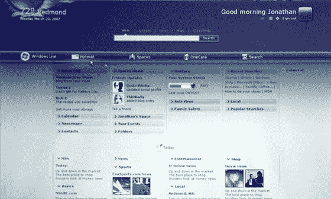

# 新的 Live.com 外观，有关 Windows Live SkyDrive 的更多信息–TechCrunch

> 原文：<https://web.archive.org/web/http://www.techcrunch.com:80/2007/08/08/new-livecom-look-feel-more-information-on-windows-live-skydrive/>

# 新的 Live.com 外观，有关 Windows Live SkyDrive 的更多信息

Windows Live 总监 Tetuya Onoda 昨天在 T2 向日本媒体展示了上面和下面的幻灯片，作为展示的一部分。上面的幻灯片显示了个性化的 Live.com 主页可能的样子(与当前版本[这里](https://web.archive.org/web/20201204174337/http://www.live.com/getstarted.aspx)进行比较)。

仍然没有与 Vista 小工具直接整合的迹象(2006 年初承诺的)，但是有一些链接到微软的服务，比如 hotmail 和日历。中间有一个“乔纳森空间”的链接，这几乎可以肯定是指他们即将推出的 SkyDrive。

  左边第二张幻灯片证实了这一点。SkyDrive 被特别提到是“无缝”Windows Live 服务的基石之一。据传，这将会持续很长一段时间，是微软将与谷歌展开正面竞争的另一个领域。