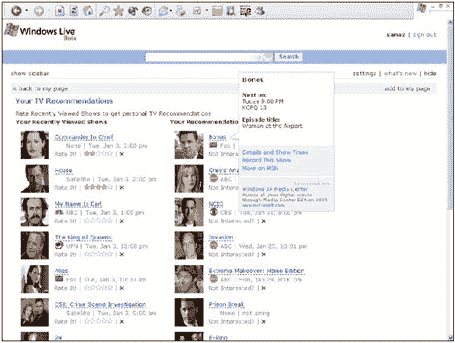

# SearchChamps 上展示的新 Live.com 服务

> 原文：<https://web.archive.org/web/http://www.techcrunch.com:80/2006/01/25/new-livecom-services-shown-at-searchchamps/>

本周，我将前往微软总部参加他们的 [SearchChamps](https://web.archive.org/web/20220527021321/http://www.ebusiness-strategies.co.uk/news160106searchchamps.htm) 活动。出席会议需要签署一份保密协议，而且讨论的大部分内容都是不允许在博客上讨论的。然而，代价是我们看到仍在实验室中开发的东西(其中一些甚至还没有到演示阶段)。

然而，有几项服务即将推出，而且不在 NDA 的覆盖范围内。它们包括一套新的 Live.com 服务。

## Live.com/Windows 小工具集成

这个最让我兴奋。Live.com 是一个完全可扩展的 ajax 主页(见这里的[我的评论](https://web.archive.org/web/20220527021321/http://www.beta.techcrunch.com/2005/11/01/windows-live-more-than-an-ajax-desktop/))——有大量的第三方“小工具”可以添加到网站上，并且可以在[microsoftgadgets.com](https://web.archive.org/web/20220527021321/http://microsoftgadgets.com/Gallery/)获得。

谷歌有一个类似的可扩展主页。

然而，与微软不同，谷歌并不控制全球绝大多数个人电脑的操作系统。Live.com 项目经理 Sanaz Ahari 宣布**微软将允许小工具在 live.com 和桌面(操作系统)之间来回拖拽。他们不会等待 Vista——Windows XP 的更新将很快推出，将允许这种拖放功能。**

结果将会是一个类似雅虎小工具的体验，用户将会有进一步的能力在操作系统和 live.com 网站之间同步小工具。

## 远程媒体中心控制

Sanaz Ahari 还展示了一些新的 Live.com/Media 中心整合。任何使用 Windows Media Center 录制电视节目的人(我愿意)也将能够通过他们的 passport 帐户和一个 live.com 小工具远程控制他们的媒体中心，在任何计算机上添加/删除/编辑录制内容。我们今天看到了一个演示，它会很酷。

请注意，这不是一个“远程查看”的公告，尽管有很多传言说这是下一步，而且似乎很明显。当然，这对 Slingbox 来说是个坏消息。

微软的克里斯·巴顿(Kris Barton)也提供了以下截图:

## 世博会

Samir Lakhani 对名为 [Expo](https://web.archive.org/web/20220527021321/http://ideas.live.com/programpage.aspx?versionId=22032d98-43b2-4855-bbf0-8e1e7645b089) (前 Fremont) ( [我的帖子在这里](https://web.archive.org/web/20220527021321/http://www.beta.techcrunch.com/2006/01/13/microsoft-expo-beta/))的新分类广告产品做了一个简短的介绍和演示。虽然该产品显然已经准备好推出，但没有真正的新信息发布。

## RSS 增强功能

Live.com 的 RSS 订阅也将很快包含图片。来自演示文稿的截图是[这里是](https://web.archive.org/web/20220527021321/http://www.searchchamps.com/images/live_2.png)。