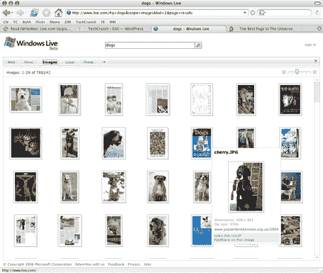

# Live.com 的新外观、新功能

> 原文：<https://web.archive.org/web/http://www.techcrunch.com/2006/03/08/new-look-features-for-livecom/>

# Live.com 的新面貌、新功能

Live.com 今天推出了一个新的工具栏和网站功能，网站有了更好的外观和感觉。新功能包括拥有多个页面的能力(这是一件好事)、增强的搜索、可供选择的新主题等等。理查德·麦克马努斯带来更多细节。

搜索功能也得到了显著增强。Live.com 显然拥有目前网络上最好的图片搜索(包括搜索结果和用户界面)。标准的网络搜索也不错——注意右边的“无限”滚动条。唯一的问题是搜索速度非常慢，微软需要立即解决这个问题。

**Live.com 团队注意:**嘿！我要在 Live.com 上发多少帖子才能让 TechCrunch 进入默认的技术订阅源？:-)

