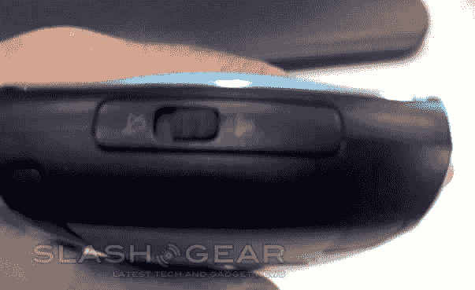

# Palm 无天线 Treo 的新照片

> 原文：<https://web.archive.org/web/http://techcrunch.com/2006/08/24/new-pics-of-palms-antenna-less-treo/>

这里有更多肖恩·康纳利 007(不是丹尼尔·克雷格 007)风格的谍照。这款手机运行的是 Windows Mobile 5，手机顶部应该有提供商标志的地方被涂黑了，所以你看不到这是什么服务。会不会是 Cingular？

[更多 Palm 新无触角 Treo 的图片](https://web.archive.org/web/20150806202445/http://www.slashgear.com/more-pictures-of-palm-new-antennae-less-treo-241152.php)

