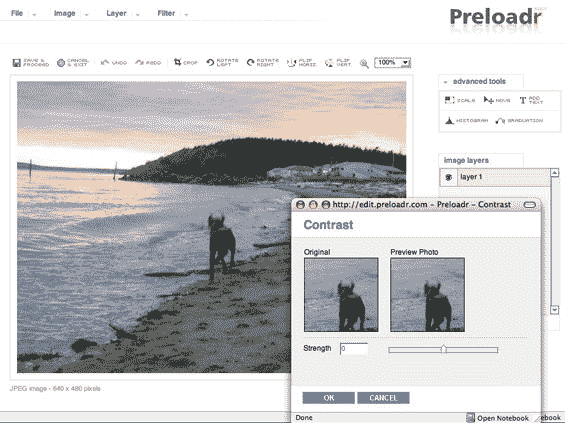

# 给 Flickr 爱好者的新东西 

> 原文：<https://web.archive.org/web/http://www.techcrunch.com:80/2006/07/18/new-stuff-for-flickr-freaks/>

两家公司于上周成立，试图建立一个只为 Flickr 用户服务的业务——Flickr inspector 和 T2 Preloadr。巧合的是，两家公司都位于欧洲。

顺便说一句，Flickr 在照片类别中绝对超过了它的权重，当谈到关注度与相对大小时。与每月约 600 万美国访客和 8000 万左右页面浏览量的其他网站相比，它远远排在第六位。相比之下， [Photobucket 的](https://web.archive.org/web/20220926090733/http://www.beta.techcrunch.com/2006/04/19/2-of-us-internet-traffic-through-photobucket/)每月 1380 万美国访客和 [Yahoo Photo 的](https://web.archive.org/web/20220926090733/http://www.beta.techcrunch.com/2006/06/07/yahoo-photos-beta-launches-today/)1120 万(分别在照片类别中排名第一和第二)。CNET 的 [Webshots](https://web.archive.org/web/20220926090733/http://www.beta.techcrunch.com/2006/04/04/new-features-at-cnets-webshots/) 也略大于 Flickr，每月有 760 万美国访客。(资料来源:康姆斯克，2006 年 6 月)

 **[FlickrInspector](https://web.archive.org/web/20220926090733/http://netomer.de/flickrtools/inspector/)是一个简单的工具，它使用 Flickr API 来提供关于特定 Flickr 用户的信息。照片，标签，联系人的照片，集(相册)等。任何 Flickr 用户都可以在网站上看到。

**Preloadr**

[Preloadr](https://web.archive.org/web/20220926090733/http://www.preloadr.com/)是一款非常有用的基于 flickr 的照片编辑工具。他们将 Flickr API 与 nexImage 照片编辑软件整合在一起，并将其作为一种新的免费在线服务呈现出来。不需要注册(甚至是可能的)——你只需通过 Preloadr 网站登录你的 flickr 账户。

图片可以上传、编辑并传输到 Flickr，也可以从 Flickr 下载图片，在 Preloadr 上编辑后再传输回 Flickr。有几个编辑工具，如裁剪，锐化，色彩校正等。它唯一没有的东西，除非我错过了，是一个万能的“增强”按钮，似乎在 iPhoto 中经常工作。正如在这篇博客中提到的，红眼去除剂也很受欢迎。

Preloadr 不是唯一的，甚至不是最好的在线照片编辑服务。我最喜欢的是 [PXN8](https://web.archive.org/web/20220926090733/http://pxn8.com/) ，也提供 Flickr 集成。其他的还有[创作在线](https://web.archive.org/web/20220926090733/http://www.creatingonline.com/online_image_editor/index.html)、[狙击](https://web.archive.org/web/20220926090733/http://snipshot.com/)和[图片 2 生活](https://web.archive.org/web/20220926090733/http://www.picture2life.com/)。

**