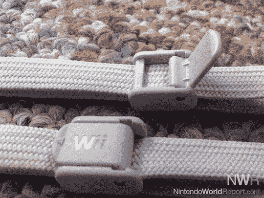

# 新的，更紧的 Wii 遥控器带子被发现:夹子实际上锁定在适当的位置

> 原文：<https://web.archive.org/web/http://techcrunch.com/2007/08/06/new-tighter-wii-remote-control-straps-spotted-clips-that-actually-lock-in-place/>

# 新的，更紧的 Wii 遥控器带子被发现:夹子实际上锁定在适当的位置

我敢打赌任天堂没有预料到会有这么多人失去对他们的 [Wii](https://web.archive.org/web/20130628211805/http://crunchgear.com/category/wii/) 遥控器的控制，在这个过程中毁坏电视和破坏婚姻。为了补救这一点，该公司自系统推出以来一直在发布改进的遥控腕带。另一个类似的 Wii 表带版本在周末出现，这个版本的特点是夹子更紧。这些夹子锁定而不是滑动，以确保与表带更牢固的连接。

这些新的带子刚刚被发现，还不知道你是否可以打电话给任天堂订购一对。

[新的 Wii 腕带开始流通](https://web.archive.org/web/20130628211805/http://www.nintendoworldreport.com/newsArt.cfm?artid=14160)【任天堂世界通过[下一代](https://web.archive.org/web/20130628211805/http://www.next-gen.biz/index.php?option=com_content&task=view&id=6709&Itemid=2)报道】