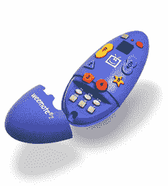

# 商店里新版本的 Wiimote

> 原文：<https://web.archive.org/web/http://techcrunch.com/2007/02/26/new-version-of-wiimote-out-in-stores/>

不完全是。这是 SmartHome 的*wee mote*3——一个为小孩子设计的特殊遥控器，这样他们就不会去看像*德克萨斯电锯杀人狂*这样的恐怖电影。成人对遥控器进行编程，使孩子只能观看您的孩子可以安全观看的经批准的电台。遥控器本身对孩子非常友好，只有几个按钮需要处理。它甚至有内置 TiVo 的遥控代码，这样你的孩子就可以随时观看《爱探险的朵拉》。

虽然它不是来自任天堂，但它仍然是针对儿童的，并且保证当你去“检查我的新 Weemote！”时，你的朋友脸上会露出困惑的表情让你的孩子远离脏话连篇的节目只会让你花费 21.99 美元。

[SmartHome 的 Weemote 3 儿童遥控器](https://web.archive.org/web/20160123154025/http://www.popgadget.net/2007/02/weemote.php)【pop gadget】