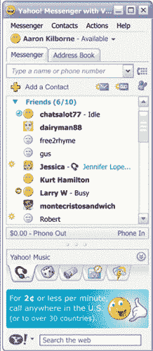

# VOIP Yahoo Messenger 明天发布

> 原文：<https://web.archive.org/web/http://www.techcrunch.com/2006/03/21/new-voip-yahoo-messenger-launches-tomorrow/>

# VOIP 雅虎信使明天发布

  这已经来了很久了，但从明天(3 月 22 日)开始，你可以下载(如果你有 Windows 机器的话)新的[雅虎 IM 客户端](https://web.archive.org/web/20230323150659/http://voice.yahoo.com/)，它具有全面的呼入和呼出 VOIP 功能。这意味着，像 Skype 一样，用户将能够接听和拨打任何普通电话(标准电话服务通常被称为“POTS”)。屏幕截图如下。

价格对 Skype 具有竞争力:

*   电话输出:从你的电脑上拨打大约 180 个国家的普通电话号码。定价为每分钟 0.02 美元起。欲了解更多费率信息，请点击查看[。](https://web.archive.org/web/20230323150659/http://voice.yahoo.com/)
*   电话呼入:(仅适用于美国、法国和英国用户)-在您的 PC 上接听传统电话和移动电话的来电，每月 2.99 美元或每年 29.90 美元。
*   免费语音邮件:免费的呼入语音邮件，语音邮件信息从雅虎邮箱链接。

雅虎上的电话平均比 Skype 便宜一点(Skype 的欧元费率在这里是)。电话服务也更便宜——Skype 的同类产品每年收费 30 欧元。当然，Skype 有视频通话，而雅虎没有。令人沮丧的是，这两家公司都不支持电话录音功能。

雅虎授权 GIPS VoiceEngine 多媒体基础设施用于后端 VOIP 技术。

