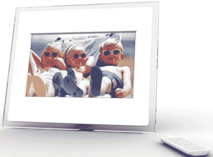

# 新的支持 WiFi 的框架功能 SideShow–TechCrunch

> 原文：<https://web.archive.org/web/http://techcrunch.com/2006/10/23/new-wifi-enabled-frame-features-sideshow/>

# 新的支持 WiFi 的框架具有 SideShow 功能

一个活生生的图片已经把它的新的无线网络相框放到了亚马逊上，伙计，我也想要一个。尽管从来没有人来我的公寓看 800×480 分辨率的 TFT 显示屏，但不用那些毫无疑问的低技术含量的“相册”来看我的照片也是一种很酷的方式该框架的其他功能包括多格式存储卡读卡器、USB 插孔、RF 遥控器和 WMA 和 MP3 格式的音频输出。不过，这个模型真正酷的地方是对 Windows SideShow 的支持。如果你从未玩过 SideShow，这意味着你简单的小相框现在也可以显示你的股票投资组合、天气、电视时间表和活动日历。相当不错的东西。有两种型号，7 英寸(200 美元)和 10.5 英寸(300 美元)。

[图片:Momento](https://web.archive.org/web/20200903025333/http://www.istartedsomething.com/20061023/alivingpicture-momento/) via [Engadget](https://web.archive.org/web/20200903025333/http://www.engadget.com/2006/10/23/a-living-pictures-momento-wifi-photo-frames-with-sideshow/)