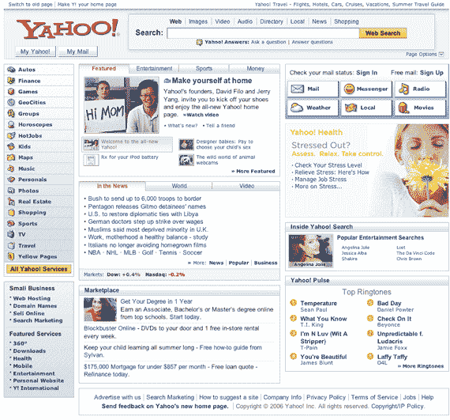
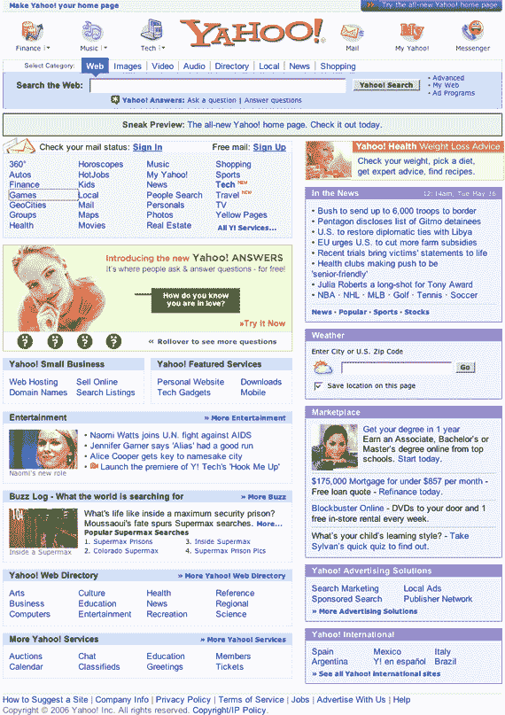

# 新的雅虎主页今天上线

> 原文：<https://web.archive.org/web/http://www.techcrunch.com:80/2006/07/17/new-yahoo-home-page-goes-live-today/>

# 新的雅虎主页今天上线

  今天雅虎新闻很多。除了今天晚些时候推出的[新雅虎财经网站](https://web.archive.org/web/20220808221040/http://www.beta.techcrunch.com/2006/07/17/yahoo-tweaks-finance/)之外，雅虎终于在 yahoo.com 主网站上推出了它的新主页，之前在[yahoo.com/preview](https://web.archive.org/web/20220808221040/http://www.yahoo.com/preview)处于测试阶段。仅在美国发布，其他市场将很快跟进。

我们都知道这是迟早的事。早在二月份，雅虎就开始用一些用户测试新的主页。五月，雅虎向上述链接的 yahoo.com/preview 域名的所有人开放了新页面。

新的主页有一个明显不同于当前外观的布局，以及一些 Ajax 集成、DHTML 和更多个性化功能。在 2006 年 5 月 15 日讨论新主页的雅虎博客文章中讨论了其他新功能。在那篇文章中，他们称之为“www.yahoo.com 主页有史以来最重大的重新设计”。鉴于雅虎是互联网上最大的网站(尽管最近被 Myspace 收购了)，他们拥抱新的网络技术是一个重要的进步。**未来几天，数百万人可能会第一次接触 Ajax。**

更多信息请见理查德·麦克马努斯，以及雅虎围绕这一问题举办的视频竞赛的一些废话。很棒的独家新闻，理查德。

新旧雅虎页面的屏幕截图:

**新增:**

**旧:**

