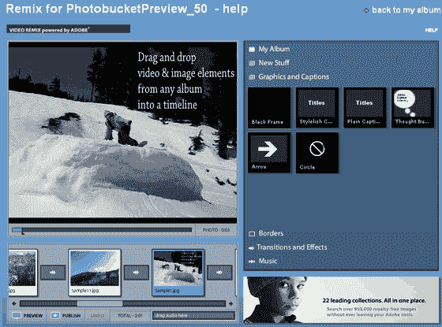
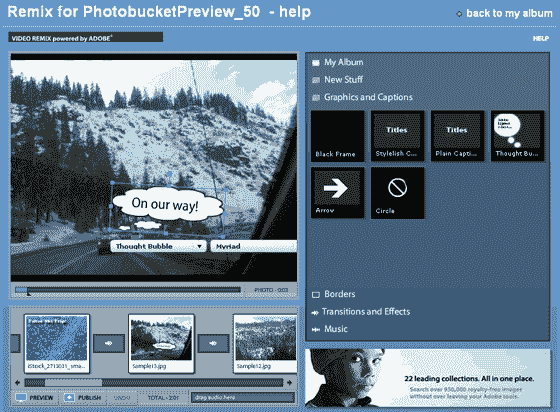

# Photobucket TechCrunch 上展示的最新 Flash 工具

> 原文：<https://web.archive.org/web/http://www.techcrunch.com:80/2007/02/16/newest-flash-tools-on-display-at-photobucket/>

# Photobucket 上展示的最新 Flash 工具

我们上周[提到的最新 Flash 照片/视频/声音编辑工具](https://web.archive.org/web/20221005145028/http://www.beta.techcrunch.com/2007/02/09/photobucket-to-launch-new-flash-video-editing-tools/)现已在 Photobucket 上为高级用户启用，并将于 3 月份面向所有用户上线。Adobe 的 Geoff Baum 证实，除了 Photobucket 之外，这些工具还不能在网络上的任何地方使用。

新工具允许 PhotoBucket 用户将照片、视频和股票音乐文件混搭到一个幻灯片/视频中，然后在任何网站上显示这些混搭。下面的屏幕截图有助于描述他们正在做的一些事情，但使这些工具比视频端的 [Motionbox](https://web.archive.org/web/20221005145028/http://www.beta.techcrunch.com/2006/04/02/motionbox-best-online-video-sharing-so-far/) 、 [JumpCut](https://web.archive.org/web/20221005145028/http://www.beta.techcrunch.com/2006/04/05/online-video-sites-breeding-like-rabbits/) ( [被雅虎](https://web.archive.org/web/20221005145028/http://www.beta.techcrunch.com/2006/09/27/yahoo-has-acquired-jumpcut/)收购)和 [Cuts](https://web.archive.org/web/20221005145028/http://www.beta.techcrunch.com/2007/02/03/sneak-peek-video-remixing-with-cuts/) 以及照片端的 Slide 和 RockYou 更好的关键变化是制作这些工具有多快和多容易。本周早些时候，我去了 Photobucket 的办公室进行了一次测试，我们创建了一个照片和视频混搭，并在一瞬间添加了音乐。一个例子:

[http://s0005.photobucket.com/remix/player.swf?video URL = http://vid 0005 . photobucket . com/albums/0005/photobucket preview _ 50/fad 59286 . pbr&hostname = stream 0005 . photobucket . com](https://web.archive.org/web/20221005145028/http://s0005.photobucket.com/remix/player.swf?videoURL=http://vid0005.photobucket.com/albums/0005/PhotobucketPreview_50/fad59286.pbr&hostname=stream0005.photobucket.com)

用户被限制上传他们自己的音频文件(版权问题推动了这一点)，但 Photobucket 表示，他们可能会添加一个记录按钮，以允许未来对照片/视频流进行叙述。目前，有一些授权的库存音乐可供选择。用户还可以向 mashup 添加过渡效果、文本气泡、框架和其他效果。

由于这些工具是由 Adobe 开发的，它们也将提供给 Photobucket 的竞争对手，我预计这些竞争对手在不久的将来也会推出类似的产品。然而，由于是第一家，Photobucket 领先于其他公司。这种优势有多大，还有待观察。

Photobucket 总部位于科罗拉多州和硅谷，拥有 60 名员工。他们在两轮融资中筹集了 1500 万美元。

截图如下:

