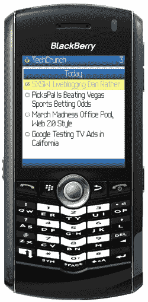

# NewsGator Go！:Java 和黑莓 RSS

> 原文：<https://web.archive.org/web/http://techcrunch.com/2007/03/13/newsgator-go-java-and-blackberry-rss/>

# NewsGator Go！:Java 和黑莓 RSS

NewsGator Go！以前只适用于 Windows Mobile，现在适用于黑莓和支持 Java 的手机，包括诺基亚、摩托罗拉和三星的手机。

这个版本与你的在线 [NewsGator](https://web.archive.org/web/20201127213540/http://www.newsgator.com/) 账户同步，并缓存文章供以后离线使用。你也可以通过程序的界面用电子邮件发送故事。

这有点类似于 Helio 的 HOT service，一个通过标准 Helio 界面弹出流行故事的迷你 RSS 小工具。检查网站的兼容性，但现在大多数手机都内置了 Java 客户端，所以这应该不是问题。

NewsGator Go！单独售价 29.95 美元，加上 NewsGator 的其他产品(FeedDemon、NetNewsWire 和 Inbox)售价 14.95 美元。明天就正式上市了，但是你们今天得到了最热门的消息。享受吧。

[产品页面](https://web.archive.org/web/20201127213540/http://www.newsgator.com/)