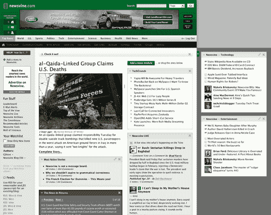

# Newsvine 今日重启:建立自己的新闻网站 

> 原文：<https://web.archive.org/web/http://www.techcrunch.com:80/2007/04/24/newsvine-relaunch-today-build-your-own-news-site/>

# 今日新闻:建立你自己的新闻网站

总部位于西雅图的新闻网站 [Newsvine](https://web.archive.org/web/20221001140117/http://www.newsvine.com/) 将于今天下午重新上线，用户体验将有重大改变。他们称这次发行为“常青树”

变化包括:像 Netvibes、Pageflakes 和其他个性化主页一样，用户现在可以移动 Newsvine 主页上的大多数模块，或者完全删除它们。用户还可以通过添加一个 RSS 提要模块将他们想要的任何新闻提要添加到主页上。

到目前为止，允许定制的 web 服务通常将特性放在一个独立的区域。例如，雅虎有 my.yahoo，但不允许用户修改雅虎主页。就像他们经常复制的允许用户评论新闻条目的功能一样，这可能是 Newsvine 重塑在线新闻行业的另一种方式。我不会对《纽约时报》、《今日美国》和其他网站允许用户创建自己的报纸版本感到惊讶，甚至可能在明年左右允许外部 RSS 订阅。这建立了强烈的用户忠诚度，使他们更有可能在网站上花更多的时间。

其他功能包括添加当地头条新闻和天气，以及一个名为“图片新闻”的幻灯片，显示连续的美联社图片流。

Newsvine 也变得更大，从 900 像素扩展到 1240 像素。额外的宽度可以通过点击来折叠。

2005 年 7 月，Newsvine 仅从第二大道伙伴公司(Second Avenue Partners)获得了 125 万美元的单轮融资。他们有六名员工。该网站目前每月有 60 万独立访问者，每月页面浏览量为 350 万。

