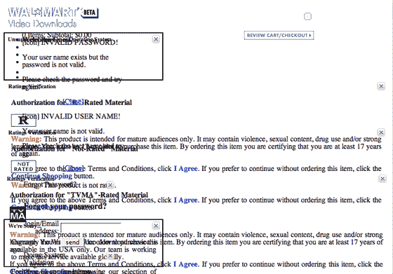

# 好样的，沃尔玛

> 原文：<https://web.archive.org/web/http://www.techcrunch.com:80/2007/02/06/nice-one-walmart.>

### 迈克尔·阿灵顿

这是沃尔玛的全新视频网站在火狐浏览器中的样子。它在 Internet Explorer 中运行良好，但是 CSS 在 Firefox 中加载不正确。一位设计师的观点是:“有人真的搞砸了。我可以在 30 秒内修好它。他们在发布之前在 Firefox 中测试过吗？”

这篇文章发表于 2007 年 2 月 6 日星期二下午 12:23，归档在[公司&产品简介](https://web.archive.org/web/20080208120843/http://www.techcrunch.com/category/company-product-profiles/ "View all posts in Company & Product Profiles")下。您可以通过 [RSS 2.0](https://web.archive.org/web/20080208120843/http://www.techcrunch.com/2007/02/06/nice-one-walmart/feed/) feed 关注该条目的任何回复。评论和 pings 目前都已关闭。