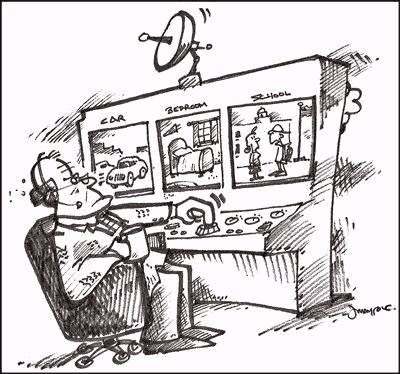

# 尼尔森现在追踪你的手机习惯

> 原文：<https://web.archive.org/web/http://techcrunch.com/2007/06/28/nielsen-now-tracks-your-cellphone-habits/>

你可能已经熟悉尼尔森，这家跟踪和监测电视观看习惯的公司。只是他们不想再因为这个出名了。不，他们想从这个美好的、蒸蒸日上的手机行业中分一杯羹。所以它收购了一家公司——Telephia——来追踪和监控手机的使用。有了 Telephia 的技术，Nielsen 将能够记录你使用的所有时间，你浏览的所有网页，你听的音乐等等。所有这些都是为了让尼尔森转过身来对广告商说，“天哪，看起来孩子们喜欢参观……嗯，你不想知道吗？我们会告诉您，但这需要您付费……”

当然，这是假设有足够多的人除了用手机打电话和拍模糊的照片之外，还会做其他事情。看起来好像我没有兴趣为热门铃声支付*任何东西*，嗯，我想也没什么可追踪的。

尼尔森增加了手机追踪功能【纽约时报】