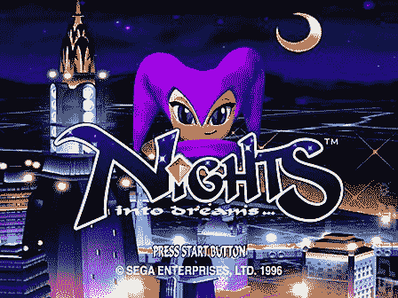

# 任天堂 Wii 的夜间续作计划

> 原文：<https://web.archive.org/web/http://techcrunch.com/2007/03/21/nights-sequel-planned-for-nintendo-wii/>

# 任天堂 Wii 的夜间续作计划

就是这样。就当我被卖了。如果你想打一个*真的软，puppyesque 点*在我心里，去为世嘉土星。有消息称，有史以来最好的平台之一将会为任天堂 Wii 推出续作。Sonic Team 已经与任天堂和 SEGA 确认，他们正在开发一款新的夜间游戏，该游戏将采用 Wiimote 进行控制，并有每个人都喜欢的紫色帽子小丑。

随着这一消息最近得到证实，1996 年原版土星经典*夜入梦乡*在任天堂的虚拟主机上发布只是时间问题。

[确认:夜晚出现在任天堂 Wii 上](https://web.archive.org/web/20210224220020/http://livenintendo.com/2007/03/19/confirmed-nights-to-show-up-on-the-nintendo-wii/)【实况任天堂】