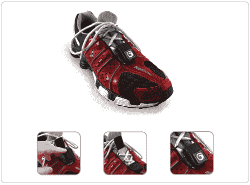

# Nike+iPod Caseling | TechCrunch

> 原文：<https://web.archive.org/web/http://techcrunch.com:80/2006/08/16/nikeipod-caseling/>

我刚刚安装了 Nike+iPod，这样我就可以计算我去厕所和回来的时间，我发现你基本上必须有一双[耐克鞋](https://web.archive.org/web/20141020110541/http://www.nike.com/nikeplus/?ref=uslanding&sitesrc=uslanding)来搭配这个套件，我已经多年没有穿耐克跑鞋了，可能也不会买一双。一个穷孩子能做什么？

他可以从 Marware 买这个小盒子。它只是挂在你的鞋子上，价格大约 10 美元。不过，我想我会把这个东西塞在塑料袋里，然后用某种方式把它系在我的鞋带上。有没有人想出不穿鞋子就把它连起来的方法？

[产品页面](https://web.archive.org/web/20141020110541/http://www.marware.com/)【Marware via[ipod nn](https://web.archive.org/web/20141020110541/http://www.ipodnn.com/articles/06/08/07/nikeipod.with.non.nike/)