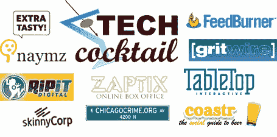

# 九家芝加哥初创公司出席科技鸡尾酒会 

> 原文：<https://web.archive.org/web/http://www.techcrunch.com:80/2006/07/09/nine-chicago-startups-present-at-tech-cocktail/>

  第一届[科技鸡尾酒会](https://web.archive.org/web/20220927014244/http://www.techcocktail.com/blog/)于 7 月 6 日在芝加哥州立餐厅和咖啡馆举行。该活动以南非葡萄酒为特色，团结了超过 225 名中西部参与者，包括风险资本家、企业家、开发商和技术爱好者。九家芝加哥地区的公司出席了会议。来自事件[的图片在这里](https://web.archive.org/web/20220927014244/http://www.flickr.com/search/?s=rec&w=all&q=techcocktail1&m=text)。

ChicagoCrime.org 是一个可自由浏览的芝加哥犯罪报告数据库，是最初的谷歌地图混搭应用之一。它是由开发者 [Adrian Holovaty](https://web.archive.org/web/20220927014244/http://www.holovaty.com/) 创建的，Adrian Holovaty 是芝加哥居民，也是 Django 框架的首席开发者。Chicagocrime.org 获得了 2005 年的新闻创新奖，并被《纽约时报》评为 2005 年最佳创意之一。虽然 Chicagocrime.org 没有获得资金，也不是一家真正的公司，但我们认为它为其他 mashups 的效仿开辟了道路，这是值得强调的。

[coaster](https://web.archive.org/web/20220927014244/http://www.coastr.com/)，在线社交啤酒指南，创建的目的是将热情、志同道合的人与新的啤酒厂和啤酒饮用机构联系起来。它是由 Luckymonk 的 Brian Eng 创建的，是一个用 Ruby on Rails 构建的简单应用程序。Coastr 允许你注册提交你最喜欢的啤酒和啤酒饮用地点。你也可以探索、评价和评论你最喜欢的啤酒。此外，Coastr 还提供了一个 [WordPress 小工具](https://web.archive.org/web/20220927014244/http://ottodestruct.com/blog/2006/04/27/coastr-widget/)，可以添加到博客中，与博客访客分享你最喜欢的啤酒。:-)

[extrasty](https://web.archive.org/web/20220927014244/http://www.extratasty.com/)(TechCrunch 简介[此处](https://web.archive.org/web/20220927014244/http://www.beta.techcrunch.com/2006/01/07/extratasty-have-a-drink/))很好地融入了科技鸡尾酒主题，是 skinnyCorp 的一项创新，该公司拥有一系列在线产品，包括 t 恤设计网站 [Threadless](https://web.archive.org/web/20220927014244/http://www.threadless.com/) 、独立音乐网站[15 Megs Fame](https://web.archive.org/web/20220927014244/http://15megsoffame.com/)和 [Naked and Angry](https://web.archive.org/web/20220927014244/http://www.nakedandangry.com/) 。ExtraTasty 是一个用户生成的饮料配方网站，除了饮料评级系统和评论外，还提供标签、通过网站和短信提交饮料。一个有趣的功能是交互式饮料测量秤，它允许您点击饮料份量，秤会计算出适当的酒量来调制特定的饮料配方。
 [FeedBurner](https://web.archive.org/web/20220927014244/http://www.feedburner.com/) 是一家位于西环路的 feed 管理公司，为超过 200，000 家出版商处理超过 1，700 万份订阅。FeedBurner 有很多有趣的产品，包括针对消息 feed 读者群的 feed metrics 包。TechCrunch 的 feed 由 FeedBurner 管理，该网站拥有超过 80，000 名订户。FeedBurner 也一直将自己定位为一个有针对性的 feed 广告选择。利用 FeedFlare 技术，FeedBurner 已经能够在网站的内容项目下插入广告。可以把它想象成一个供稿和网站的广告网络，这使得 FeedBurner 成为一个有吸引力的收购目标。

Gritwire 是[diz person Technologies](https://web.archive.org/web/20220927014244/http://www.dizpersion.com/)的一个创造，之前[曾在 TechCrunch 上评论过](https://web.archive.org/web/20220927014244/http://www.beta.techcrunch.com/2006/03/30/the-state-of-online-feed-readers/)。它提供了许多有用的工具，包括 [MyGritwire](https://web.archive.org/web/20220927014244/http://my.gritwire.com/) ，一个基于 flash 的 feed 聚合器，内置播客和视频播放器，以及社交网络功能，允许您添加联系人，推荐和评价 feed 内容。Gritwire 最近推出了一个名为 GritLists 的新功能。Gritlists 允许你创建一个编辑化的阅读列表。其他用户可以通过 Gritwire 聚合器订阅您的列表。刚好赶上 TECHcocktail，Gritwire 发布了 [Gritlist 徽章](https://web.archive.org/web/20220927014244/http://www.gritwire.com/createBadge.asp)，它允许你在自己的博客、网站、MySpace 或 Friendster 个人资料页面上发布最新的阅读清单。
 [Naymz](https://web.archive.org/web/20220927014244/http://www.naymz.com/) 是一个在线身份聚合器，由 Tom Drugan 和其他四个人创建，他们都曾是 Orbitz 的成员。Naymz 允许你聚合所有你的个人在线内容的链接(博客、照片、社交网络简介、新闻文章、简历等)。)放到一个 Naymz 页面上。这个个人聚合，或个人 Naymz 页面，将被优化为搜索引擎可查找性，以便任何人通过搜索找到你。该公司有五名员工，并获得了 25 万美元的天使投资。有时候，只说“谷歌我”比留下电话号码或电子邮件地址更容易，这就是 Naymz 这样的产品可以派上用场的地方——特别是当越来越多的人通过博客、照片或在线视频创建在线身份时。

Greg Frost 创办的音乐转换服务公司 RipIt Digital 可以将 CD、磁带和唱片转换成数字格式，并将其下载到你的 iPod、MP3 播放器或媒体服务器上。RipIt Digital 为消费者节省了翻录音乐的时间和麻烦，并提供与 ReadyToPlay.com 和 GetDigitalInc.com 类似的服务。RipIt Digital 在一年的时间里转换了超过 2000 千兆字节的音乐。

桌面互动通过将体育酒吧或餐厅的桌子变成娱乐控制中心，将电视和网络结合在一起。每台设备始终连接到服务器，提供直播体育比分和链接到 DirecTV 体育频道的更新。你可以查看新闻，玩触摸屏游戏，在琐事和幻想运动中与你所在地和全国各地的人竞争，并在你最喜欢的体育酒吧从你的桌子上订购饮料和食物。它就像一个超级遥控器，所以你可以在你的座位上看你想看的比赛。桌面上个月在圣地亚哥的球员运动酒吧首次亮相。桌面有一个有趣的商业模式，包括销售实际设备，每月服务费，与任何游戏收入五五分成，桌面所有者有权获得系统上 25%的广告位，用于推广他们的酒吧或餐馆或出售给第三方。

[ZapTix](https://web.archive.org/web/20220927014244/http://www.zaptix.com/) ，由[克里斯蒂安·佩里](https://web.archive.org/web/20220927014244/http://www.mashdown.com/)创建的在线社区票务网站，最近推出测试版。由于这项服务是一个年轻的测试版，从推出两个星期，因此它在票务内容上是轻的，有一些皱纹，但它们应该在测试期解决。ZapTix 希望将社区剧院票务引入互联网。在真正的自举风格中，整个公司的成立成本不到 1 万美元，将开发过程的每一步都外包出去，没有雇佣全职员工。

