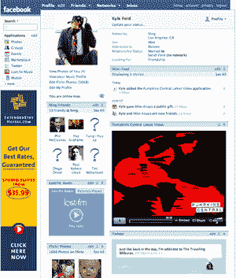

# 宁推出 App Builder:将你的社交网络嵌入社交网络——TechCrunch

> 原文：<https://web.archive.org/web/http://www.techcrunch.com:80/2007/06/16/ning-rolls-out-facebook-app-builder-embed-your-social-network-in-a-social-network/>

# 宁推出 App Builder:把你的社交网络嵌入社交网络

 [宁](https://web.archive.org/web/20211018145824/http://www.beta.techcrunch.com/2007/02/26/ning-in-full/)[自建社交网络初创公司](https://web.archive.org/web/20211018145824/http://www.beta.techcrunch.com/2007/02/26/ning-in-full/)将于今晚晚些时候推出一项新功能，允许用户围绕他们的宁网络创建自己的应用。

这不会是阿宁的应用程序，相反，他们让网络运营商(创建了社交网络和其他应用程序的用户)能够轻松创建一个品牌的脸书应用程序。示例屏幕截图(单击查看大图)显示了 Pumkins Central(阿宁社交网络)视频的集成。屏幕截图还显示了一个单独的 Ning 应用程序，显示用户的 Ning 好友。

宁说，构建这些应用程序不需要任何编程知识，他们会给用户提供简单的一步一步的指导。由于 Ning 也是应用程序的宿主，用户不需要担心可伸缩性。

用户将能够向应用程序添加视频、音乐、播客和照片幻灯片。

对宁来说，这是明智之举，这也显示了作为一个平台和分销渠道的力量，即使对其竞争对手来说也是如此。这将在今晚晚些时候上线——首席执行官吉娜·比安奇尼周五在宁博客上的一篇文章中暗示了这一点。

查看宁的[个人资料](https://web.archive.org/web/20211018145824/http://www.crunchbase.com/company/ning)