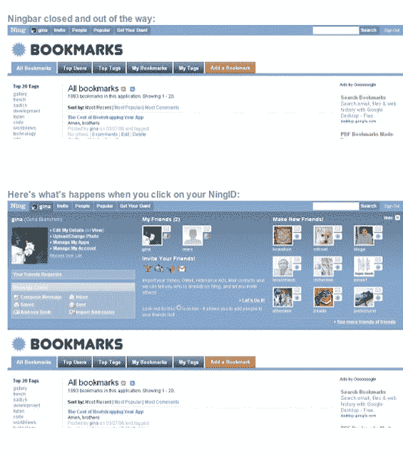

# 宁吧推出，加上宁统计 

> 原文：<https://web.archive.org/web/http://www.techcrunch.com:80/2006/06/25/ningbar-launches/>

  总部位于帕洛阿尔托的[宁](https://web.archive.org/web/20220813211138/http://www.ning.com/)周五对他们的应用程序界面做了重大改变，移除了应用程序上的强制侧边栏，代之以页面顶部完全可定制的 javascript 栏。

一周前，我会见了首席执行官 Gina Bianchini，了解了这些变化。吉娜也告诉了我宁的近况。

Ning 是一个允许用户通过 Ning 模块和第三方 web 服务创建定制应用程序的网站。CCHits 就是一个例子——用户提供知识共享音乐的链接。其他用户以类似 Digg 的方式对音乐进行投票，最好的音乐会出现在网站的顶部。或者查看[小道评论](https://web.archive.org/web/20220813211138/http://trails.ning.com/)，它将小道讨论和投票与谷歌地图结合在一起。我最喜欢的应用之一是[书签](https://web.archive.org/web/20220813211138/http://bookmarks.ning.com/)，这是一个非常有用的社会化书签服务(比如 del.icio.us)。对于啤酒和体育迷来说，还有团队运动酒吧。其他用户可以通过添加或删除模块或 web 服务来克隆 Ning 上的应用程序，这些用户想要做一些不同的事情。

应用程序由 ning 和 share 用户托管(这意味着一旦你注册了一个 Ning 应用程序，你就注册了所有应用程序)。Ning 的收入来自应用程序上的广告和付费选项。例如，应用程序创建者可以每月支付 8 美元来移除广告，或者每月支付 5 美元来将应用程序映射到自定义域。还提供其他高级选项。

**宁统计**

宁[于 2005 年 10 月推出](https://web.archive.org/web/20220813211138/http://www.beta.techcrunch.com/2005/10/04/ning-launches/)。从那时起，已经创建了 14，000 个应用程序。Ning 在 176 个国家拥有注册用户，其中 47%的用户是非美国用户。到目前为止，Ning 用户在参与的同时也在观看——平均每两个新用户到就有一个新的应用程序生成。

Alexa 页面浏览量统计显示了一些积极的趋势，尽管宁显然还没有达到“曲棍球棒”的增长阶段。

**宁吧**

Ning 已经用一个可定制的动态 javascript 条取代了每个应用程序中的强制(也是备受批评的)侧边栏[、Ning 首席架构师](https://web.archive.org/web/20220813211138/http://blog.ning.com/2006/06/introducing_the_ningbar_1.html)[迭戈·多瓦尔](https://web.archive.org/web/20220813211138/http://www.dynamicobjects.com/d2r/archives/003373.html)和[布莱恩·麦卡利斯特](https://web.archive.org/web/20220813211138/http://kasparov.skife.org/blog/ning/ningbar_baby.html)。屏幕截图如下，显示了条带的起始位置和展开位置:

在用户无需任何编程技能就能添加和删除模块和 web 服务之前，Ning 还有很长的路要走。期待一个定于夏末发布的版本，最终向所有用户开放 Ning 的核心特性。