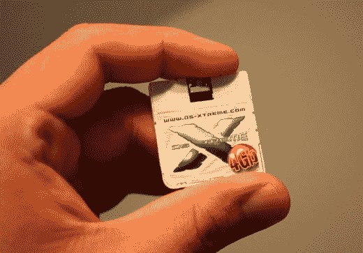

# 任天堂 DS 媒体增强器:DS-Xtreme | TechCrunch

> 原文：<https://web.archive.org/web/http://techcrunch.com/2006/10/17/nintendo-ds-media-enhancer-ds-xtreme/>

# 任天堂 DS 媒体增强器:DS-Xtreme

DS-Xtreme 是任天堂 DS 或 DS Lite 的媒体增强器。DS-Xtreme 具有 512MB 的内存，可存储游戏备份、音频、视频和自制应用程序等。这张卡使用起来非常简单——你所要做的就是即插即用。DS-Xtreme 配有一个 USB 端口，可插入 PC 并将其自身装载为闪存驱动器。你所要做的就是拖放，把卡到您的 DS 或 DS Lite 游戏插槽，你准备去。游戏备份存储为。NDS 文件和音频文件都存储为 MP3。当您通过 DS-Xtreme 玩游戏时，它的运行方式应该完全像您在 DS 中玩游戏一样。音乐也同样始终如一。看起来，如果你有一个这样的，你就不需要随身携带那些奢侈的案件与一堆口袋，你也不需要所有的小袖子和/或硬案件为您的游戏，因为你不需要带着他们。

目前还没有任何关于 DS-Xtreme 如何运行以及哪些自制应用程序在 DS-Xtreme 上运行的信息，但我们肯定能知道这款售价 125 美元的媒体增强器何时发布，应该是在未来几周。