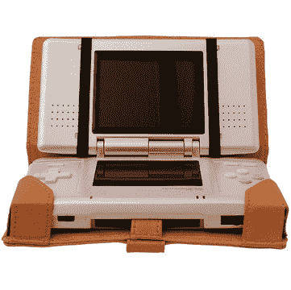

# 任天堂高管宣称“欧洲胜利”|技术危机

> 原文：<https://web.archive.org/web/http://techcrunch.com/2007/03/20/nintendo-exec-claims-victory-in-europe/>

现在因为 Tech.co.uk 认为引用确切的消息来源是一派胡言，所以没有证据证明任天堂的高管。雷吉·费尔斯·艾梅说，Wii 是“欧洲的胜利”但是现在，我要假设确实说过这句话。看，任天堂不是新的黑色，而是新的博格。愚蠢的无人机不停地前进，称赞任天堂的一切，认为这家日本视频游戏公司不会做错事。但是我现在还不会宣称“欧洲的胜利”，雷吉·邱吉尔。

雷吉引用这句话的依据是，因为 Xbox 360 在英国卖得最好，Wii 在任何地方都卖不出去，所以它在整个欧洲都表现不佳。他接着指出，Wii 上架时就已经卖完了，并指出售出的数量(上个月有 33.5 万 Wii 消费者，22.8 万 Xbox 360，12.7 万 PS3)，但这只是一个数字游戏。

那么，可以肯定地说，任天堂的 Wii 是目前最受欢迎的游戏机吗？当然！但是欧洲胜利日呢？几乎不

[任天堂老板宣称“欧洲胜利”](https://web.archive.org/web/20150523074648/http://www.tech.co.uk/home-entertainment/gaming/consoles/news/nintendo-boss-claims-victory-in-europe?articleid=433873916)【Tech.co.uk】