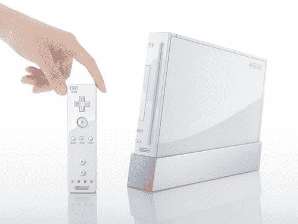

# 任天堂再次确认 Wii 单元

> 原文：<https://web.archive.org/web/http://techcrunch.com/2006/09/07/nintendo-reconfirms-wii-units/>

美国任天堂公司今天发布了一份官方声明，称他们仍计划在 2007 年 3 月 31 日之前在全球范围内销售 600 万台 Wii 游戏机。任天堂还没有宣布这款游戏机将于哪天上市，或者售价是多少。尽管发布日期未知，但根据 [GameSpot](https://web.archive.org/web/20150421093332/http://www.gamespot.com/) 的消息，一些配件已经在 [GameStop](https://web.archive.org/web/20150421093332/http://www.gamestop.com/gs/wii/wii_signup.asp) 网站上出现供预订。

> 消费者网站 GameSpot 发现，该网站上包括一款售价 9.99 美元的 Wii“控制器手套”，一款售价 59.99 美元的“高清高级组件电缆”和一款售价 39.99 美元的“S-Video 高级 AV 电缆”。
> 
> 以及各种收纳箱和袋子，上市了两种不同的 SD 记忆棒，512MB 版本售价 39.99 美元，1GB 版本售价 59.99 美元。这些物品都被列为 MadCatz、BD & A 和 SanDisk 等制造商的第三方产品，没有任何任天堂自己的第三方产品的定价或性质的指示。

光是看着这些好吃的东西就让我充满期待。不是所有人都有机会在发布会上得到一台 Playstation 3，但我们都会有机会体验看似不可思议的任天堂 Wii。

[任天堂 Wii 单元确认](https://web.archive.org/web/20150421093332/http://www.gamasutra.com/php-bin/news_index.php?story=10779)