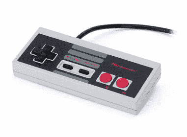

# 任天堂回应 PS3 降价说“拿来”

> 原文：<https://web.archive.org/web/http://techcrunch.com/2007/07/10/nintendo-says-bring-it-in-response-to-ps3-price-cut/>

战斗！索尼可能已经[将其 PS3 的价格](https://web.archive.org/web/20160307004335/http://crunchgear.com/2007/07/09/sony-slashes-100-off-ps3/)削减了 100 美元，但任天堂一点也不担心。不，任天堂不仅不担心，还在召唤索尼。副总统乔治·哈里逊说:

> 100 美元的降价不会有什么影响。索尼能承受 200 美元的降价吗？我不这么认为。"

我倾向于犯“100 美元不会有什么不同”的错误，特别是当你考虑到，现在，PS3 没有值得一文的独家游戏。虽然 500 美元的蓝光播放器很有吸引力，但一旦你意识到，除了地球上的*之外，这种媒介正在被浪费，新车的味道肯定会消失。(更糟糕的是，蓝光版的 *300* 将[与 HD DVD 版的](https://web.archive.org/web/20160307004335/http://crunchgear.com/2007/07/02/hd-dvd-not-dead-not-even-close-says-toshiba/)相比相形见绌。)*

最后，让我们等到第一批销售数据出来后，再开始讨论“索尼(仍然)很烂！”赶时髦。毕竟，它们只是视频游戏机。没有理由变得不正常。

任天堂表示，PS3 价格下降没有影响