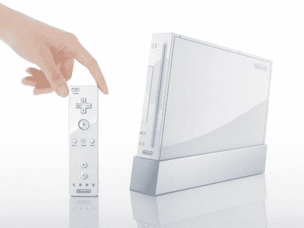

# 任天堂 Wii: 480p 发布确认

> 原文：<https://web.archive.org/web/http://techcrunch.com/2006/10/20/nintendo-wii-480p-at-launch-confirmed/>

# 任天堂 Wii: 480p 发布确认

有很多关于任天堂 Wii 是否会在发布时为拥有大屏幕电视并希望在逐行扫描模式下运行 Wii 游戏的用户提供分量电缆的讨论。昨天，美国任天堂对这个话题发表了评论，告诉我们 Wii 将在主机发布的当天通过组件电缆支持 480p。分量线必须单独购买，价格为 29.99 美元，只能通过 EB Games、Best Buy、Gamestop 和 Circuit City 等在线零售店购买。任天堂没有说为什么这些电缆只能在网上获得，但这不是他们第一次这样做了。当 GameCube 发布时，我们看到了同样类型的事情发生。

在你问之前，不，GameCube 组件电缆不能与 Wii 一起工作。大概是因为 Wii 的输入(猜测)看起来要 USB 了。看来我得在拿到游戏机之前订购 Wii 的组件了。

[任天堂 Wii: 480p 发布确认](https://web.archive.org/web/20130627210229/http://wii.ign.com/articles/740/740296p1.html)