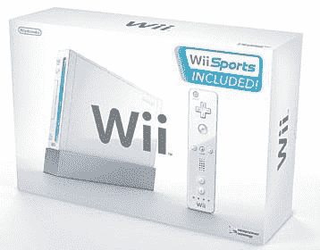

# 任天堂 Wii 地区锁定 TechCrunch

> 原文：<https://web.archive.org/web/http://techcrunch.com/2006/09/18/nintendo-wii-region-locked/>

# 任天堂 Wii 区域锁定

任天堂英国总经理 David Yarnton 表示，美国任天堂公司告诉我们游戏机将不受地区限制是错误的，事实上，任天堂 Wii 将受到地区限制。太糟糕了，如果能通过合法途径从日本进口，那就太好了。看起来用户将不得不用 Wii 和 mod 游戏机来玩其他地区的游戏。

据我们在 [SlashGear](https://web.archive.org/web/20210302024159/http://www.slashgear.com/wii-not-region-free-181672.php#more-1672) 的朋友说，有另一种理论流传开来，Wii 将对美国和日本地区免费，但对欧洲锁定。也不知道这个有多合法，我们会让你知道的！

[任天堂 Wii 地区锁定](https://web.archive.org/web/20210302024159/http://www.slashgear.com/wii-not-region-free-181672.php#more-1672)