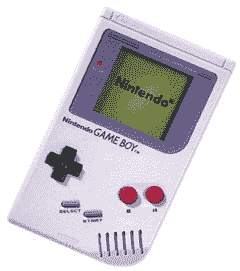

# 任天堂的哈里森说游戏男孩要出局了

> 原文：<https://web.archive.org/web/http://techcrunch.com/2007/07/17/nintendos-harrison-says-game-boy-on-its-way-out/>

# 任天堂的哈里森说游戏男孩即将退出

如果没有任天堂的 Game Boy，便携式游戏将不复存在。我记得在 1989 年收到一个原始模型作为礼物，我立刻就爱上了它。*俄罗斯方块*，*超级马里奥大陆*。几乎每一场比赛对我来说都成了经典。现在有消息称，任天堂可能会让 Game Boy 永远退休。随着任天堂 DS 越来越受欢迎，对 Game Boy Advance 的需求正在迅速下降。

任天堂营销高级副总裁乔治·哈里逊对 Game Boy 有如下评论:

> “今年在我们的营销中，你真的不会看到对 Game Boy 本身的太多推动，所以它会寻求自己的水平。很难说将来我们是否会恢复 Game Boy 的商标，”

哦，推测。很明显，游戏男孩正在逐渐消失，每年受到的关注也越来越少，但是整个系统都被扼杀了吗？哈里森说，我们必须等到 2008 年。任天堂正在做很多事情，摆脱我童年的一个主食可能是其中之一。当“它”发生时，这将是游戏中真正悲伤的一天。

哈里森:任天堂可能会让游戏机“退休”