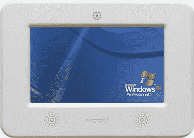

# Nobu 8 英寸壁挂式触摸屏–TechCrunch

> 原文：<https://web.archive.org/web/http://techcrunch.com/2006/09/25/nobu-8-in-wall-touchscreen/>

# Nobu 8 英寸壁挂式触摸屏

这个来自 Nobu 的新系统被设计成墙内系统的极致。它在一个小外壳内配备了一个 8”聚酯层压手指触摸屏。该系统由无风扇 1GHz 英特尔赛扬 M 处理器、4GB 嵌入式磁盘卡和最大 1GB DDR 内存运行。它包括以太网，但 WiFi 是可选的。

这些东西我一件也用不着，但我还是想要一件。我真的只能想象这种工作在商业环境中，但我想可能会有一些很酷的家庭自动化应用程序为人们提供银行服务。该设备将于 12 月中旬发货，价格为 3625 美元。

[Nobu 8 英寸内壁触摸屏电脑](https://web.archive.org/web/20201125145410/http://www.mavromatic.com/archives/000571)