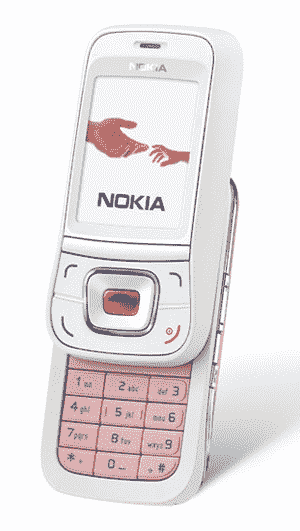

# 诺基亚 7088:爱情奢侈品，还是简单的滑块？

> 原文：<https://web.archive.org/web/http://techcrunch.com/2007/03/29/nokia-7088-lamour-luxury-or-simple-slider/>

诺基亚 7088 刚刚举行了它的犹太成年礼，现在是一个男人了…嗯，现在不再只是一个谣言了。这款手机将成为诺基亚“爱慕”(法语“俗气”的意思)系列的一部分，是第一款获得这一殊荣的 CDMA 手机。我不知道诺基亚打算如何用一个看起来像是基本滑盖的东西来对抗其他“奢侈”手机。这里没有疯狂的[镜面](https://web.archive.org/web/20140620053106/http://crunchgear.com/2007/02/20/lg-shine-20-now-with-35g-hsdpa/)效果，也没有任何花哨的[触摸屏](https://web.archive.org/web/20140620053106/http://crunchgear.com/2007/03/15/lgs-prada-phone-unboxed-its-real-its-hot/)可言。中间的按钮显然像宝石一样，手机本身被皮革包裹。哇，好像你要成为皇室成员才能用这个电话。如果你很快就想要一个，你最好不要住在美国，因为它的 Q2 发布日期只适用于亚洲、中东和拉丁美洲。

[产品页面](https://web.archive.org/web/20140620053106/http://www.nokia-asia.com/nokia/0,8764,101141,00.html)【诺基亚 via [Ubergizmo](https://web.archive.org/web/20140620053106/http://www.ubergizmo.com/15/archives/2007/03/nokia_7088_now_a_fact.html)