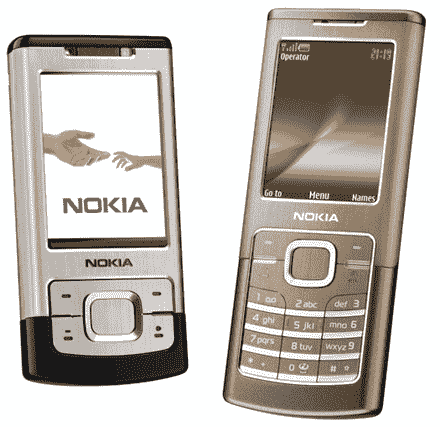

# 诺基亚宣布推出两种口味的 6500

> 原文：<https://web.archive.org/web/http://techcrunch.com/2007/06/01/nokia-announces-6500-in-two-flavors/>

# 诺基亚宣布推出两种口味的 6500

图片取自 [Engadget](https://web.archive.org/web/20130628182318/http://www.engadgetmobile.com/2007/05/31/nokia-outs-midrange-6500-in-slider-and-candybar-flavors) AOL 关键字:ENGAGE
Hyv ppiv【读者】。(这是芬兰语的下午好，如果你想知道的话。)诺基亚宣布了两个版本的中档 6500，我相信你会感到惊喜。“经典”版本是一种简单的糖果棒风格，相当薄，只有 9.5 毫米，但它有一种奇怪的褐色阳极氧化铝，这让我想知道诺基亚设计师在抽什么。除了颜色，Classic 还有一个 200 万像素的摄像头，1GB 的内部存储空间(就像哇！)，microUSB 插槽，蓝牙和它运行在四频 GSM 与 UMTS。

“Slide”增加了自动对焦卡尔·蔡司 320 万像素摄像头的赌注，该摄像头具有双 LED 闪光灯、microSD 插槽、集成的 FM 收音机和 TV out。它比经典款稍大，但它是滑盖，所以我对它 16.4 毫米的周长没意见。6500 的两个版本将于第三季度上市，价格分别为€320 和€370。

[新闻稿](https://web.archive.org/web/20130628182318/http://www.nokia.com/A4136001?newsid=1130283)