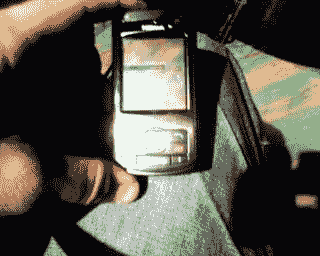
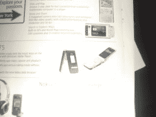
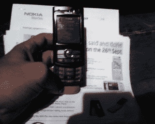

# 诺基亚扔掉了一堆手机

> 原文：<https://web.archive.org/web/http://techcrunch.com:80/2006/09/26/nokia-drops-a-bunch-of-phones/>

好吧，这些照片的质量和帕丽斯·希尔顿的色情照片差不多，但我不喜欢比格斯毫无理由地把一切弄得一团糟。因此，这里有一些热门男子手打电话的行动，供您观赏的乐趣。建议观众自行判断:

在这里，你会看到 N95 在顶部。它有一个 500 万像素的摄像头，全球定位系统，世界地图，无线局域网和 HSDPA。预计花费大约 87215684265 美元。

下一张图片是 N75，它具有 200 万像素摄像头和音乐播放功能。

底部是 N80ie，也在上面和下面的图片中。

这是 N80ie。它拥有更强大的网络功能、WiFi 和一个 300 万像素的摄像头。它被装在一个光滑的盒子里，表面是性感的黑色。