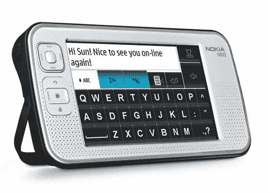

# 诺基亚互联网平板操作系统升级| TechCrunch

> 原文：<https://web.archive.org/web/http://techcrunch.com:80/2007/07/06/nokia-internet-tablet-os-gets-upgraded/>

诺基亚可能没有多点触摸屏，但他们确实有一些苹果没有的东西。N800 本身不是一部手机，但 Wi-Fi 功能加上最新的升级使这款平板电脑成为一股不可忽视的力量。最新版本 4.2007.26-8 包括 Skype、Adobe Flash 9、支持高达 8GB 的存储卡(潜在支持高达 16GB)以及电池寿命的改进。电池寿命的提高可以归功于无线连接的改进。外部存储卡上的内容也可以更有效地读取，以帮助提高设备的寿命。

升级时会附带一些其他预装内容。网络电台频道已经更新，并且可以更容易地安装真正的 Rhapsody。一个 tablateer 信息小程序和有趣的(？)新的网站也包括在内。诺基亚互联网通话邀请，这是在测试阶段，现在已经结束，该服务将于 2007 年 8 月 31 日终止。
[立即下载！](https://web.archive.org/web/20160422005528/http://tablets-dev.nokia.com/nokia_N800.php)

[互联网平板电脑 OS 2007 版](https://web.archive.org/web/20160422005528/http://maemo.org/news/view/1183705330.html)功能升级发布【通过[平板电脑博客](https://web.archive.org/web/20160422005528/http://tabletblog.com/2007/07/breaking-news-new-firmware-is-here.html)