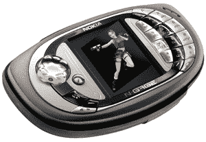

# 诺基亚制作关于破解的跨平台游戏

> 原文：<https://web.archive.org/web/http://techcrunch.com/2007/07/02/nokia-making-cross-platform-games-about-crack/>

比 PS3 还酷

诺基亚的使命是创造一款跨平台且不烂的手机游戏。第一个项目，据传可以在 PC 和手机上运行，名为“白石计划”。从名字来看，我敢说标题将是一个 MMORPG，玩家们竞相沉迷于快克可卡因。或者不是。

但是在 N-Gage 的失败之后，诺基亚还能在便携式/移动游戏世界里留下一点痕迹吗？我表示怀疑。登记册上写着这样的话，我觉得手机游戏会变得更糟:

> “……看到高通展示了一款连接到跳舞毯上的手机，并表示打算开发与 Playstation 3 配套的手机，”

将与 [Playstation 3](https://web.archive.org/web/20160422003140/http://crunchgear.com/2007/01/26/the-playstation-3-is-the-best-console-ever/) 竞争的手机？祝你好运把蓝光播放器塞进手机，更别说 PS3 拥有的所有其他好东西了。坚持你的芯片和技术专利，高通。据我所知，游戏似乎不是你的强项。

[N-Gage 游戏等同于 PC 游戏](https://web.archive.org/web/20160422003140/http://www.theregister.co.uk/2007/07/02/nokia_pc_games/)【注册】